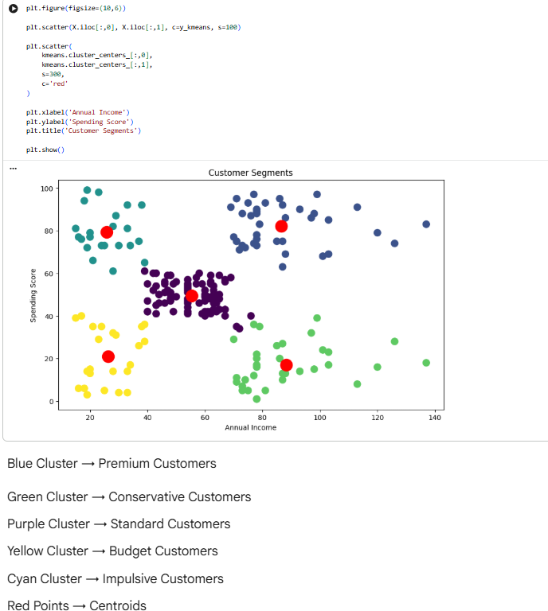
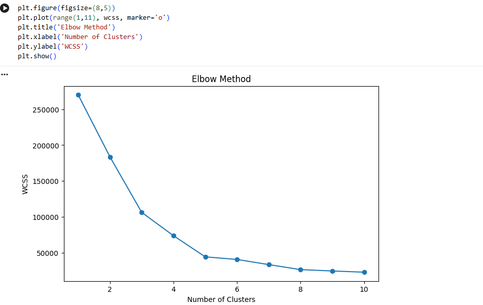

# Customer Segmentation using K-Means Clustering

## Project Title
Customer Segmentation using K-Means Clustering

## 🌐 Live Application

**Segmentra Dashboard:** (https://segmentra.streamlit.app/)

## Problem Statement
This project segments mall customers into meaningful groups using income and spending behavior. The goal is to help businesses create targeted marketing strategies and improve customer engagement.

## Objective
- Segment customers using K-Means clustering
- Identify key customer groups by spending and income
- Visualize clusters and centroids
- Generate business insights for marketing and sales

## Dataset Information
- Dataset name: `Mall_Customers.csv`
- Description: Mall customer demographic and spending data
- Main columns:
  - `CustomerID`
  - `Gender`
  - `Age`
  - `Annual Income (k$)`
  - `Spending Score (1-100)`

## Technologies Used
- Python
- Jupyter Notebook
- Pandas
- Matplotlib
- Seaborn
- Scikit-learn

## Workflow
1. Load and inspect the dataset
2. Clean and prepare the data
3. Use the elbow method to select the best number of clusters
4. Train the K-Means clustering model
5. Visualize the clusters and centroids
6. Interpret the customer segments

## Elbow Method Explanation
The elbow method measures the model inertia for different cluster values. We choose the number of clusters where the decrease in inertia slows down significantly, forming an elbow shape. This helps find a good balance between cluster accuracy and simplicity.

## K-Means Clustering Explanation
K-Means groups customers by similarity. It chooses cluster centers (centroids) and assigns each customer to the nearest center. The algorithm repeats until clusters become stable.

## Cluster Visualization
### Customer Segments

### Elbow Method

## Business Insights
- Premium Customers (Blue Cluster): High income, high spending. Excellent targets for premium products, loyalty rewards, and exclusive offers.
- Conservative Customers (Green Cluster): High income, low spending. They respond well to value-focused campaigns and low-risk offers.
- Standard Customers (Purple Cluster): Moderate income and spending. A stable group ideal for cross-selling and retention offers.
- Budget Customers (Yellow Cluster): Low income, low spending. Use discounts, bundles, and affordable promotions.
- Impulsive Customers (Cyan Cluster): Low income, high spending. Best reached with impulse-buy deals and attractive limited-time offers.
- Red Points are centroids and represent the center of each customer cluster.

## Conclusion
This project successfully segments customers into six groups using K-Means clustering. These customer segments can help businesses tailor marketing campaigns, improve customer targeting, and increase revenue.

## Future Improvements
- Add age and gender to the clustering model
- Build an interactive dashboard for business users
- Test other clustering techniques such as DBSCAN
- Use customer lifetime value for advanced segmentation
